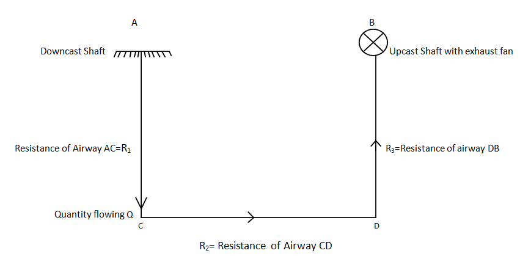

### INTRODUCTION 

A series ventilation circuit is one in which the air is first used in one workplace, then directed to another workplace and then potentially reused in many other workplaces. It has also been variously described as “cascade” ventilation or “daisychaining”.

The flow of air in a series airway can be easily compared to that of an electrical circuit connected in series. We know that electrical current flows through a branch if there exists a potential difference between the two ends (Ohm’s law). Similarly airflow through an airway results from difference of pressure between the higher pressure end at the inflow and the lower pressure at the outflow end. Even the Kirchhoff’s laws of electric circuit are valid in case of airflows. The understanding of series airways can be achieved by making the following assumptions -:

Current = Quantity of air or volume flow rate (Q) in m3/sec 
Resistance (R) = Resistance offered by airway (R) in Ns2m-8 
Voltage drop (V) = Pressure drop (P) in Pa

## Some specifications of a series circuit are -:
 
<ul style="text-indent:50px;text-align:justify;list-style-position: inside;">
<li>The quantity of air flowing through each airway is same i.e Q = Q1=Q2=Q3 (Please refer Fig 1) </li>
<li>The total pressure drop across A and B (Fig 1) is equal to the pressure drop across airways 1 , 2 and 3 i.e., P = P1+P2+P3</li>
</ul>

  
  
Fig 1. Resistance connected in series
 
  
Source: (<a href="https://nptel.ac.in/courses/123/106/123106002/">https://nptel.ac.in/courses/123/106/123106002/
</a>)

  

When air flow occurs in two or more roadways in series, quantity of air, flowing through every roadway is the same, say ‘Q’ (assuming no leakage) and the pressure spent ‘P’ is the sum of the pressure spent in individual roadways.	

i.e. P = P1+P2+P3+…………………………+Pn

Using P = RQ2

Hence, RequQ2 = R1Q2+R2Q2+R3Q2+……………….RnQ2

Or, Requ  =  R1+ R2+ R3+……………………………….. Rn 

Where,

Requ  = Equivalent resistance of n roadways connected in series and R1, R2, R3,……………………………….. Rn

In general, for ‘n’ number of airways connected in series we get-: 
Req = ∑ Ri

### MERITS AND DEMERITS OF SERIES AIRWAYS 

## Merits 
<ul style="text-indent:50px;text-align:justify;list-style-position: inside;">
<li>It makes more efficient use of air as it is more used in its path.</li> 
<li>Nowadays for higher production we need to go for large development size of airways. Conventionally, its 3m x3m, but now a day’s 6m x 6m is more commonly used in many parts of the world. In this case series connection is advantageous as we can maintain the air velocity (since Q = V x A).</li>
<li>Series circuits are simple circuits as there are no splits.</li>
<li>There is a lesser need for Ventilation Control Devices (VCD) in particular regulators. 
There are less chances of leakage of air.</li> 
</ul>

## Demerits 
<ul style="text-indent:50px;text-align:justify;list-style-position: inside;">
<li>Since the fresh air is not supplied to each district, it results in poor working conditions.</li> 
<li>In case of fire, explosion or any other accident in one panel, the production from the other panels is also disrupted.</li> 
</ul>
